# AWS Crypto Market ETL Pipeline

A fully automated AWS ETL pipeline for ingesting, transforming, cataloging, and querying crypto market data from the CoinGecko API.

This project follows a **Bronze → Silver → Gold** data lake architecture using **Amazon S3, AWS Lambda, Amazon EventBridge, AWS Glue, AWS Glue Crawler, AWS Glue Data Catalog, and Amazon Athena**.

---

## Project Overview

This pipeline collects crypto market data at regular intervals, stores the raw API response in Amazon S3, transforms it into analytics-ready Parquet datasets, builds Gold-layer summary tables, catalogs the data automatically, and enables SQL-based querying through Amazon Athena.


---

## Architecture Diagram

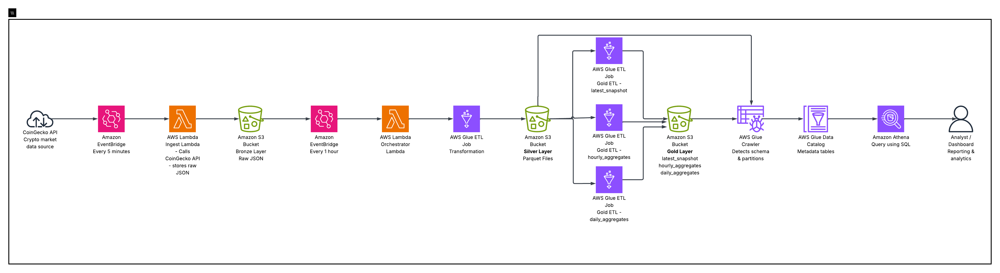

---

## Technologies Used

- **Amazon EventBridge** – schedule-based pipeline automation
- **AWS Lambda** – API ingestion and orchestration
- **Amazon S3** – Bronze, Silver, and Gold storage layers
- **AWS Glue** – ETL processing with PySpark
- **AWS Glue Crawler** – automatic schema and partition detection
- **AWS Glue Data Catalog** – metadata management
- **Amazon Athena** – SQL querying on S3 data
- **CoinGecko API** – crypto market data source
- **Python / PySpark** – data processing logic

---

## End-to-End Pipeline Flow

### 1. Data Ingestion

An **EventBridge rule** runs every **5 minutes** and triggers the `extraction_coin_api` Lambda function.

This Lambda:
- calls the CoinGecko API
- extracts crypto market data for selected coins
- stores the raw JSON response in the S3 **Bronze layer**

Example raw path:

```text
s3://coin-project-newone/raw/ingest_date=2026-03-19/ingest_hour=07/markets_20260319_073046_3651e242.json
```

---

### 2. Orchestration

A second **EventBridge rule** runs **hourly** and triggers the `orchestrator_lambda_for_glue` Lambda function.

This Lambda:

- calculates the previous UTC hour
- checks whether raw data exists for that hour
- starts the AWS Glue transformation job
- passes parameters such as ingest date and ingest hour

---

### 3. Bronze to Silver Transformation

The AWS Glue job reads raw JSON data from the Bronze layer and performs transformations such as:

- extracting the relevant `data` field
- flattening nested JSON
- selecting required columns
- cleaning and formatting the data
- writing partitioned **Parquet** output into the Silver layer

Example transformed path:

```text
s3://coin-project-newone/transformed/ingest_date=2026-03-19/ingest_hour=07/part-00000-9f6356b8-6bae-4209-a41d-6d9a0e88427b.c000.snappy.parquet
```

---

### 4. Gold Layer Creation

Additional Glue ETL jobs read data from the Silver layer and generate analytics-ready Gold datasets:

- **latest_snapshot** → latest available record for each coin
- **hourly_aggregates** → hourly summarized data
- **daily_aggregates** → daily summarized data

Gold layer paths:

```text
s3://coin-project-newone/gold/latest_snapshot/
s3://coin-project-newone/gold/hourly_aggregates/
s3://coin-project-newone/gold/daily_aggregates/
```

---

### 5. Cataloging and Querying

Glue Crawlers are used to automatically detect schema and partitions from the Silver and Gold layers.

The discovered tables are stored in the **Glue Data Catalog** and queried using **Amazon Athena**.

This allows SQL-based analytics directly on top of data stored in Amazon S3.

---

## Data Lake Architecture

### Bronze Layer

Stores raw API responses in JSON format.

- **Source:** CoinGecko API
- **Format:** JSON
- **Partitioning:** `ingest_date`, `ingest_hour`

### Silver Layer

Stores cleaned and flattened data in Parquet format.

- **Format:** Parquet
- **Partitioning:** `ingest_date`, `ingest_hour`
- **Purpose:** structured, query-efficient storage

### Gold Layer

Stores analytics-ready datasets for business and reporting use cases.

- `latest_snapshot`
- `hourly_aggregates`
- `daily_aggregates`

---

## Project Structure

```text
crypto-aws-etl-pipeline/
├── README.md
├── .gitignore
├── docs/
│   └──aws_project.png
├── lambda/
│   ├── extraction_coin_api/
│   │   └── extraction_coin_api.py
│   └── orchestrator_lambda_for_glue/
│       └── orchestrator_lambda_for_glue.py
├── glue/
│   ├── bronze_to_silver/
│   │   └── job.py
│   └── gold/
│       ├── latest_snapshot.py
│       ├── hourly_aggregates.py
│       └── daily_aggregates.py
├── config/
│   └── env.example
└── screenshots/
```

---


## Screenshots

### EventBridge Schedules

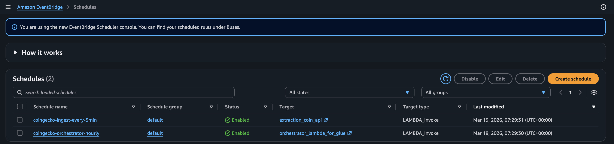

### S3 Bucket Structure

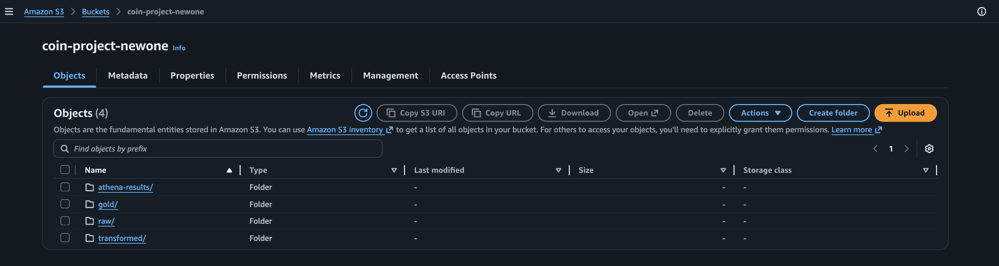

### Raw Partition Structure

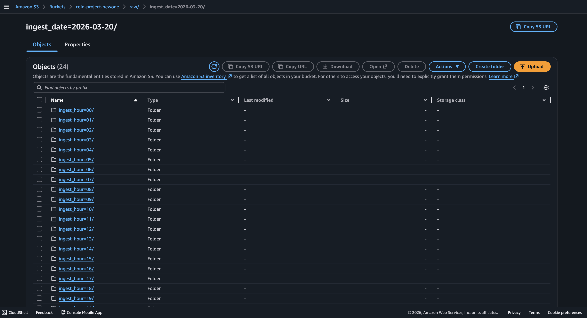

### Lambda Functions

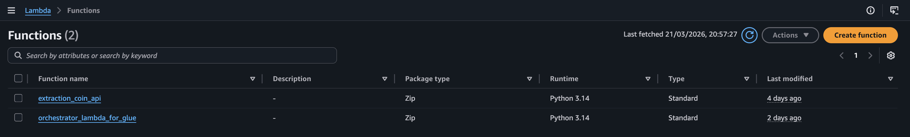

### Glue Jobs

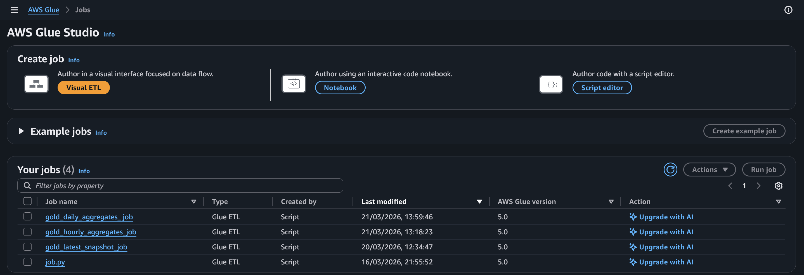

### Glue Crawlers

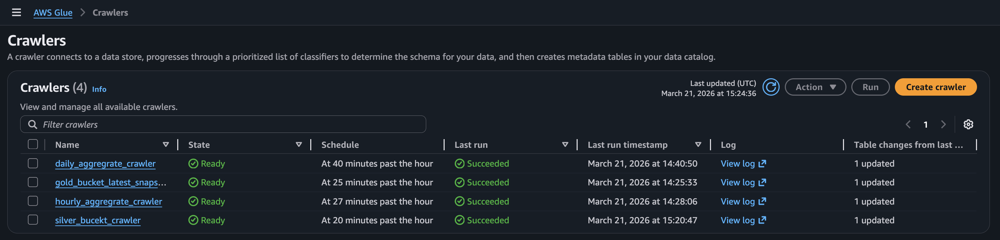

### Glue Catalog Tables


### Athena - Transformed Table

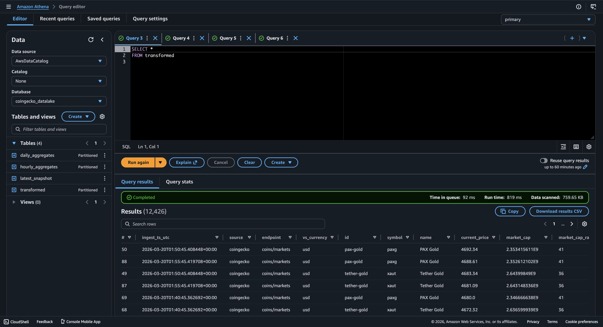

### Athena - Latest Snapshot

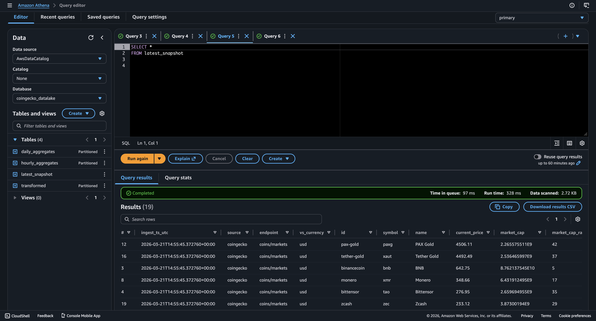

### Athena - Hourly Aggregates

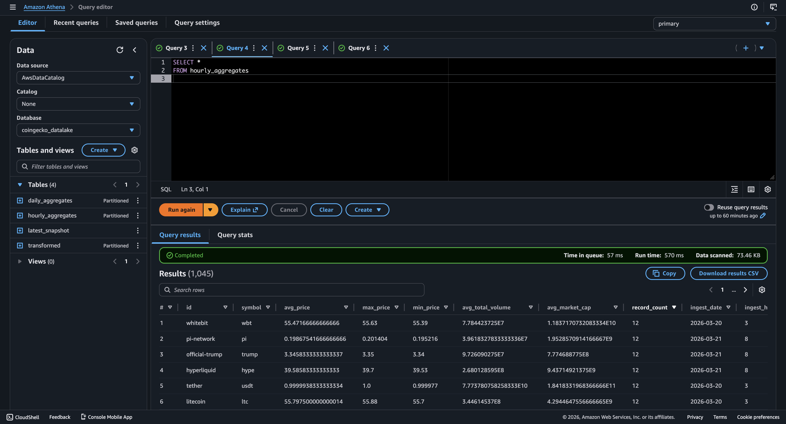

### Athena - Daily Aggregates

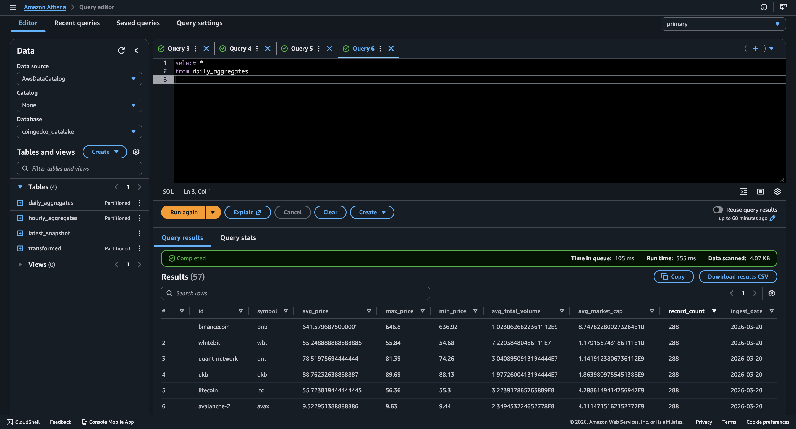

---

## How Automation Works

This pipeline is fully automated through scheduled AWS services:

- EventBridge triggers the ingestion Lambda every 5 minutes
- EventBridge triggers the orchestrator Lambda every hour
- the orchestrator Lambda starts the Glue transformation job
- Glue jobs generate Silver and Gold datasets
- Glue Crawlers update schema and partitions
- Athena queries the final cataloged tables

This design removes the need for manual execution and enables continuous ingestion and transformation of crypto market data.

---

## Example Output Datasets

### latest_snapshot

Provides the latest available market record for each tracked coin.

### hourly_aggregates

Provides hourly summarized values across the ingested data.

### daily_aggregates

Provides daily summarized metrics for trend analysis.

---

## Key Learning Outcomes

This project demonstrates:

- building a serverless ingestion pipeline on AWS
- using scheduled event-driven workflows
- designing a Bronze/Silver/Gold data lake
- transforming nested JSON into structured Parquet
- using AWS Glue for distributed ETL
- cataloging datasets with Glue Crawlers
- querying data lake tables using Athena
- organizing a cloud data engineering project for GitHub portfolio presentation

---
